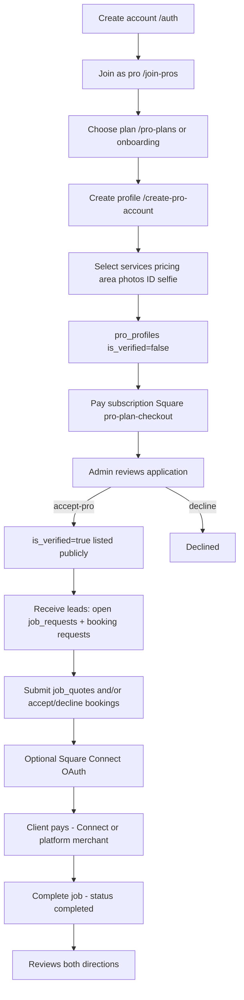

# SUPABASE LEGAL DATA INVENTORY — Première Services

**Document type:** Read-only technical inventory for Quebec privacy/business counsel  
**Inspection date:** 2026-08-13  
**Sources:** Live Supabase project (SQL metadata via MCP), application codebase (`src/`, `supabase/functions/`), prior fact-finding  
**Constraints observed:** No schema, RLS, auth, storage, or data changes. No secrets/API keys/tokens reproduced. Where credential material exists in tables: `SECRET/KEY FOUND — VALUE REDACTED`.

---

# PART A — PLATFORM USER JOURNEYS

*(What the lawyer needs first: how the product actually works in the UI, mapped to routes and data.)*

## A1. What Première Services is (in one paragraph)

Première Services is a bilingual (FR/EN) Canadian home-services **marketplace website**. Clients browse services by postal code, can publish a job request to receive provider quotes, or book a verified provider directly. Providers create a business profile, await admin verification, subscribe to a paid plan, respond to bookings/leads, and may collect payment via Square. There is **no dedicated client↔provider chat**; communication is via quote messages, booking auto-replies, dashboard unread flags, optional SMS/email, and platform support AI.

---

## A2. Customer journey (actual paths in code)

### Diagram (primary path — browse & book)

```mermaid
flowchart TD
  A[Homepage /] --> B[Enter postal code + need]
  B --> C[Services /services]
  C --> D[Category /services/:slug]
  D --> E[Pro list /services/.../pros]
  E --> F[Pro profile /pros/:proId]
  F --> G{Logged in?}
  G -->|No| H[/auth signup or login]
  H --> F
  G -->|Yes| I[Booking dialog: service date time location]
  I --> J[Upload ID photo + accept Terms scroll]
  J --> K[Insert bookings status=pending]
  K --> L[Dashboard: wait for pro]
  L --> M{Pro accepts?}
  M -->|Decline| N[Declined - optional email/SMS]
  M -->|Accept| O[Client pays via Square]
  O --> P[payments row + invoice_snapshot]
  P --> Q[Service performed offline]
  Q --> R[Mark completed / reviews]
  R --> S[Client reviews pro; pro may review client]
```

### Diagram (alternate path — publish a request / get quotes)

```mermaid
flowchart TD
  A[Homepage or nav] --> B[/make-request]
  B --> C{Logged in?}
  C -->|No| D[/auth then return]
  D --> B
  C -->|Yes| E[Category + describe job + photos + postal/location + timing/budget]
  E --> F[Insert job_requests + upload job-request-photos]
  F --> G[Dashboard: My requests]
  G --> H[Pros see open leads and submit job_quotes]
  H --> I[Client views quotes]
  I --> J{Accept quote?}
  J -->|Decline| K[Quote declined]
  J -->|Pay to accept| L[Square payment then quote accepted]
  L --> M[May proceed to booking/service relationship]
  M --> N[Review]
```

### Customer journey table (lawyer view)

| Step | What the customer does | Route / UI | Data written / read | Status |
|------|------------------------|------------|---------------------|--------|
| 1. Land | Opens site; sees marketing; may set language FR/EN | `/` | Locale in localStorage; browse postal cookie/localStorage | CONFIRMED |
| 2. Location | Enters postal code (hero / browse gate) | `/`, `/services` | Geocode Edge → lat/lng; postal stored client-side | CONFIRMED |
| 3. Find service | Browses categories or search | `/services`, `/services/:slug` | Reads `services` catalog; browse stats RPC | CONFIRMED |
| 4. Create account *(may be later)* | Email/password or Google; name, phone, language | `/auth` | `auth.users` + trigger → `profiles` | CONFIRMED |
| 5a. Request service | “Make a request” form | `/make-request` | `job_requests`, Storage `job-request-photos` | CONFIRMED |
| 5b. Or choose category → pros | List verified pros near postal | `/services/.../pros` | Reads `pro_profiles` / `pro_services` | CONFIRMED |
| 6. View provider | Profile, prices, reviews, portfolio | `/pros/:proId` | Reads pro tables + `reviews`; may insert `pro_profile_views` | CONFIRMED |
| 7. Receive quotes | On request path: wait for `job_quotes` | Dashboard bookings/quotes | Reads `job_quotes` for own requests | CONFIRMED |
| 8. Book | Booking wizard: service, date/time, location, ID photo, Terms | Dialog on `/pros/:proId` | Inserts `bookings` (`pending`); ID → Storage `client-booking-verification` + `profiles.booking_id_verification_photo_path` | CONFIRMED |
| 9. Pay | **After pro accepts** (booking), or **to accept a quote** | Dashboard + Square Web Payments | Edge `square-create-payment` → `payments` | CONFIRMED |
| 10. Service | Performed offline between parties | Outside app | Status updates in `bookings` | CONFIRMED |
| 11. Review | Rate/comment/photos of pro; pro may review client | Dashboard / pro page | `reviews` / `client_reviews` / photo buckets | CONFIRMED |
| Support | Optional AI help (logged-in) | `/support` or HelpFab | Edge `ai-chat-hf` → Hugging Face; chat history often localStorage | CONFIRMED |
| Claims | Report issue on booking | Dashboard → claim | `booking_claim_requests` + evidence bucket + emails | CONFIRMED |

### Important corrections vs a simplified “Pay → Service” story

| Assumption | What code actually does |
|------------|-------------------------|
| Pay immediately at book | Booking creates `pending` request; invoice text says payment after pro accepts; Square charge from Dashboard when accepted / unpaid |
| In-app chat with provider | **Not found** as a messaging product; quote `message`, booking `auto_reply_snapshot`, unread flags, SMS/email only |
| Privacy Policy page | Emails/Terms link to `/privacy` but **no app route** for Privacy Policy |

---

## A3. Provider journey (actual paths in code)

### Diagram



### Provider journey table

| Step | What the provider does | Route / UI | Data | Status |
|------|------------------------|------------|------|--------|
| 1. Create account | Same Auth as clients | `/auth` | `auth.users`, `profiles` | CONFIRMED |
| 2. Become a pro | Marketing + start | `/join-pros` | — | CONFIRMED |
| 3. Select plan | Starter / Growth / Pro; optional trial | `/pro-plans`, trial routes | `pro_subscriptions`, Square checkout Edge | CONFIRMED |
| 4. Provider profile | Business name, bio, area, phone, ID/selfie, GST/QST fields, etc. | `/create-pro-account`, editor dialog | `pro_profiles`, Storage `pro-photos` / private paths | CONFIRMED |
| 5. Select services | Categories, prices, duration, workspace address | Profile editor | `pro_services`, optional `service_bundles` | CONFIRMED |
| 6. Admin verification | Wait for platform admin | Admin `/admin/accept-pros` | Edge `accept-pro` sets `is_verified` | CONFIRMED |
| 7. Receive leads | Open job requests matching; booking notifications | Dashboard | Reads `job_requests` (open), `bookings` | CONFIRMED |
| 8. Submit quote | Price + message + ETA | Dashboard | Insert `job_quotes` | CONFIRMED |
| 9. Communicate | Quote message / auto-reply / SMS-email — **no chat thread** | Dashboard | Fields above | CONFIRMED |
| 10. Booking | Accept/decline pending booking | Dashboard | Update `bookings.status` | CONFIRMED |
| 11. Complete job | Status → completed | Dashboard | `bookings` | CONFIRMED |
| 12. Payment | Client pays via Square; pro may have Connect tokens | Edge + `payments` / `pro_square_tokens` | Tokens: SECRET/KEY FOUND — VALUE REDACTED | CONFIRMED |
| 13. Review | Review client; respond to client reviews | Dashboard / profile | `client_reviews`, `review_responses` | CONFIRMED |

---

## A4. Who interacts with whom

```text
CUSTOMER  ←→  PREMIÈRE SERVICES (platform)  ←→  PROVIDER
                |                                      |
                +-- Admin moderators                   |
                +-- Square (payments)                  +-- Square Connect (optional)
                +-- Resend / Twilio (if configured)
                +-- Hugging Face (support AI)
                +-- Google Maps / geocode providers
```

There is **no first-class private messaging channel** between customer and provider inside the product database.

---

# PART B — SUPABASE DATABASE INVENTORY

## 1. All database tables (by schema)

### 1.1 Application — `public`

`admin_actions`, `booking_claim_requests`, `bookings`, `client_review_submission_locks`, `client_reviews`, `client_saved_pros`, `job_quotes`, `job_request_moderation_notices`, `job_requests`, `payments`, `plans`, `platform_admin_config`, `platform_whats_new_announcements`, `pro_licenses`, `pro_photos`, `pro_plan_cancellations`, `pro_profile_views`, `pro_profiles`, `pro_services`, `pro_square_tokens`, `pro_subscriptions`, `profiles`, `referral_invites`, `review_photos`, `review_responses`, `review_submission_locks`, `reviews`, `service_browse_stats`, `service_bundle_items`, `service_bundles`, `services`, `subscription_plans`, `subscriptions`, `trial_attempts`, `trial_grants`, `trial_tokens`

### 1.2 Auth — `auth` (Supabase system)

Includes at least: `users`, `identities`, `sessions`, `refresh_tokens`, `audit_log_entries`, MFA/WebAuthn/OAuth/SSO-related tables, `flow_state`, `one_time_tokens`, etc.

### 1.3 Storage — `storage`

`buckets`, `objects`, multipart upload tables, etc.

### 1.4 Realtime — `realtime`

`messages` and daily partition tables (e.g. `messages_YYYY_MM_DD`).

### 1.5 Other system schemas

`extensions`, `vault`, `graphql`, `graphql_public`, `pgbouncer` (aux).

---

## 2. Public tables — purpose, columns, keys, PI flags

Legend: **PI** = potentially personal information · **Biz** = business/provider · **Pay** = payment-related

### `profiles` — Client/account profile extending Auth  
**PK:** `id` · **FK:** `user_id` → `auth.users.id`  
**Columns:** `id`, `user_id`, `full_name`, `avatar_url`, `created_at`, `updated_at`, `email_language`, `phone`, `birthday`, `address`, `postal_code`, `is_platform_admin`, `booking_id_verification_photo_path`, `public_user_number`, `job_request_strikes`, `job_requests_blocked_at`  
**PI:** Yes · **Biz:** No · **Pay:** Indirect (ID verification path)

### `pro_profiles` — Provider business profile  
**PK:** `id` · **FK:** `user_id` → `auth.users`  
**Columns:** identity/contact (`business_name`, `legal_business_name`, `bio`, `phone`, `website`), location (`location`, `latitude`, `longitude`, `service_radius_km`, workspace/travel flags), pricing/availability JSON, verification (`is_verified`, `personal_photo_url`, `id_document_url`, `approval_baseline_json`), tax (`gst_registration_number`, `qst_registration_number`), Square (`square_location_id`), subscription_tier, page theming, decline timestamps, etc.  
**PI:** Yes · **Biz:** Yes · **Pay:** Yes (processor/tax identifiers)

### `pro_services` — Services offered by a pro  
**PK:** `id` · **FK:** `pro_profile_id` → `pro_profiles` (CASCADE)  
**Columns:** slugs, prices, description, duration, `auto_reply_message`, `workspace_address` + lat/lng, `location_mode`, renewal months  
**PI:** Possible (workspace address) · **Biz:** Yes · **Pay:** Indirect (pricing)

### `pro_photos` — Gallery URLs  
**PK:** `id` · **FK:** `pro_profile_id` → `pro_profiles` (CASCADE)  
**PI:** Yes (images) · **Biz:** Yes · **Pay:** No

### `pro_licenses` — License records  
**PK:** `id` · **FK:** `pro_profile_id` → `pro_profiles` (CASCADE)  
**Columns:** `license_number`, `license_type`, `holder_name`, `is_verified`, `verification_data`, `verified_at`  
**PI:** Yes · **Biz:** Yes · **Pay:** No

### `bookings` — Appointment lifecycle  
**PK:** `id` · **FK:** `client_id` → `auth.users`; `pro_profile_id` → `pro_profiles` (CASCADE)  
**Columns:** `status`, `preferred_date`/`preferred_time`, `decline_reason`, unread flags, `invoice_number`, `public_booking_code`, `invoice_snapshot` (jsonb), distance/drive snapshots, renewal fields, service slugs, `auto_reply_snapshot`  
**PI:** Yes · **Biz:** Yes · **Pay:** Yes (invoice snapshot)

### `payments` — Square payment log  
**PK:** `id` · **FK:** `booking_id` → `bookings` (SET NULL); `pro_profile_id` → `pro_profiles` (CASCADE)  
**Columns:** `amount_cents`, `currency`, `square_payment_id`, `status`, `idempotency_key`, `card_brand`, `card_last_4`  
**PI:** Indirect · **Biz:** Yes · **Pay:** Yes

### `job_requests` — Customer “Make a request”  
**PK:** `id` · **FK:** `client_id` → `auth.users`  
**Columns:** `description`, `category`, address fields, lat/lng, `photo_urls[]`, budget/timing, AI category, moderation fields  
**PI:** Yes · **Biz:** No (client lead) · **Pay:** No (estimates only)

### `job_quotes` — Provider quotes on requests  
**PK:** `id` · **FK:** `job_request_id` → `job_requests` (CASCADE); `pro_profile_id` → `pro_profiles` (CASCADE)  
**Columns:** `price_cents`, `estimated_time`, `message`, `status`  
**PI:** Yes (message + identities) · **Biz:** Yes · **Pay:** Indirect

### `job_request_moderation_notices`  
**PK:** `id` · **FK:** `user_id` → `profiles.user_id` (CASCADE); `job_request_id` → `job_requests` (SET NULL)  
**PI:** Yes · **Biz:** No · **Pay:** No

### `reviews` / `review_photos` / `review_responses`  
Client→pro reviews + photos + pro responses.  
**PI:** Yes · **Biz:** Yes · **Pay:** No

### `client_reviews`  
Pro→client reviews (+ `photo_urls`).  
**PI:** Yes · **Biz:** Yes · **Pay:** No

### `booking_claim_requests`  
Disputes/claims: `message`, `attachment_urls`, `admin_resolution`, etc.  
**PI:** Yes · **Biz:** Yes · **Pay:** Related (resolutions may include “refunded” label)

### `pro_square_tokens`  
**PK:** `pro_profile_id` · **FK:** → `pro_profiles` (CASCADE)  
**Columns:** `merchant_id`, `access_token`, `refresh_token`, `expires_at`  
**PI:** Indirect · **Biz:** Yes · **Pay:** Yes — **SECRET/KEY FOUND — VALUE REDACTED**  
Comment in schema: client access denied; Edge Functions with service role.

### `pro_subscriptions` / `subscription_plans` / `plans` / `subscriptions`  
Plan catalog + pro (and legacy client) subscription rows; Square customer/card ids/fingerprint on pro side.  
**PI:** Yes · **Biz:** Yes · **Pay:** Yes

### `trial_tokens` / `trial_grants` / `trial_attempts`  
Trial issuance; `trial_attempts.ip_address`; `trial_grants.signup_ip` + Square ids.  
**PI:** Yes (IP, user ids) · **Biz:** Yes · **Pay:** Yes

### `referral_invites`  
`invitee_email`, codes, status timestamps.  
**PI:** Yes · **Biz:** No · **Pay:** No (reward logic)

### `client_saved_pros` / `pro_profile_views` / `service_browse_stats` / bundles  
Favorites, view counters, browse stats, pro service bundles.  
**PI:** Mixed (favorites yes) · **Biz:** Yes · **Pay:** No

### `admin_actions` / `platform_admin_config` / `platform_whats_new_announcements`  
Admin audit JSON, config key/value (synced from Edge secret name pattern), announcements (`deleted_at` soft delete).  
**PI:** Possible · **Biz:** Operational · **Pay:** No

### `review_submission_locks` / `client_review_submission_locks` / `pro_plan_cancellations`  
Lock pairs after delete; plan cancel analytics.  
**PI:** Yes · **Biz:** Yes · **Pay:** Cancel related

### `services`  
Catalog `name_en`, `name_fr`, `embedding` (vector).  
**PI:** No apparent · **Biz:** Catalog · **Pay:** No  
**RLS disabled** + grants to `anon`/`authenticated` include SELECT/INSERT/UPDATE/DELETE/TRUNCATE (see §4 / §11).

### `auth.users` (system)  
Email, phone, encrypted password, metadata, tokens, timestamps.  
**PI:** Yes · **Pay:** No direct

---

## 3. Potentially personal information (field inventory)

| Category | Where stored |
|----------|----------------|
| Names | `profiles.full_name`; `pro_profiles.business_name` / `legal_business_name`; `pro_licenses.holder_name`; Auth metadata |
| Emails | `auth.users.email`; `referral_invites.invitee_email` |
| Phones | `auth.users.phone`; `profiles.phone`; `pro_profiles.phone` |
| Addresses | `profiles.address`; `pro_profiles.business_address`; `pro_services.workspace_address`; job request city/province |
| Postal codes | `profiles.postal_code`; `job_requests.postal_code`; client browse cookie |
| Location (GPS) | `pro_profiles` / `job_requests` / workspace lat-lng |
| Profile info | Avatars, bios, availability, public_user_number |
| Messages | `job_quotes.message`; claim `message`; review content; `auto_reply_message` / snapshots |
| Reviews | `reviews`, `client_reviews`, responses, photos |
| Service requests | `job_requests.*` |
| Appointments | `bookings` schedule + status + decline_reason |
| Uploaded content | Storage URLs/paths across photos, ID docs, evidence, verification |
| User IDs | UUIDs throughout |
| Auth secrets | `auth.users` password hash/tokens; sessions/refresh; MFA secrets |
| IP addresses | `trial_attempts.ip_address`; `trial_grants.signup_ip` |
| Payment metadata | `payments` last4/brand; Square ids; OAuth tokens in `pro_square_tokens` |
| Tax numbers | GST/QST on `pro_profiles` |
| DOB | `profiles.birthday` |

---

## 4. Row Level Security policies

### 4.1 RLS enabled / disabled

| Table | RLS enabled |
|-------|-------------|
| All listed `public` tables except `services` | **true** |
| `public.services` | **false** |
| Most other public tables with **no policies** listed below | RLS on ⇒ default deny for JWT roles unless policy exists; **service_role bypasses RLS** |

**Tables with RLS enabled but no `pg_policies` rows found in audit:**  
`admin_actions`, `plans`, `subscriptions`, `platform_admin_config`, `pro_square_tokens`, `pro_plan_cancellations`, `trial_tokens`, `trial_attempts`  
→ Effect for `anon`/`authenticated` via PostgREST: no policy ⇒ no access (unless granted via SECURITY DEFINER RPC). Edge/service role can still access.

### 4.2 Policy catalog (`public`)

For each policy: **table · operation · roles · condition (qual / with_check)**

| Table | Policy | Op | Roles | Condition (summary) |
|-------|--------|----|-------|---------------------|
| bookings | Anyone can view bookings | SELECT | public | `true` |
| bookings | Authenticated can create booking | INSERT | public | `auth.uid() = client_id` |
| bookings | Pro can update own booking | UPDATE | public | pro owns `pro_profile_id` |
| profiles | Anyone can view profiles | SELECT | public | `true` |
| profiles | Users insert/update own | INSERT/UPDATE | public | `auth.uid() = user_id` |
| profiles | Moderators read profiles for support | SELECT | authenticated | moderator OR own |
| pro_profiles | Anyone can view pro profiles | SELECT | public | `true` |
| pro_profiles | Pros insert/update/delete own | I/U/D | public | `auth.uid() = user_id` |
| pro_profiles | Admin/moderator update any | UPDATE | authenticated | `auth_is_platform_moderator()` |
| pro_services / pro_photos / pro_licenses | Anyone view; pro manage own | SELECT/I/U/D | public | view `true`; mutate if owns pro |
| reviews | Anyone view; user CRUD own | S/I/U/D | public | view `true`; mutate `reviewer_id` |
| review_photos / review_responses | Anyone view; owner mutate | mixed | public | as named |
| client_reviews | Anyone read; pro insert/update | S/I/U | public | view `true`; pro owns profile |
| job_requests | Users insert/read/update own; pros read open; moderators read/update | S/I/U | public/auth | as named (open + pro exists) |
| job_quotes | Client read/update own jobs’ quotes; pro CRUD own quotes | S/I/U | public | ownership joins |
| payments | Client/pro read own; platform admin read | SELECT | public/auth | booking/pro ownership or moderator |
| booking_claim_requests | Client insert own; admin read/update | I/S/U | authenticated | as named |
| client_saved_pros | User full CRUD own | S/I/U/D | public | `auth.uid() = user_id` |
| pro_subscriptions | User read own; admin read all | SELECT | authenticated | own or moderator |
| referral_invites | Users read own invites | SELECT | authenticated | inviter |
| trial_grants | Users read own | SELECT | authenticated | own |
| platform_whats_new_* | Authenticated read active; admin write | S/I/U | authenticated | `deleted_at IS NULL` / moderator |
| service_bundles(+items) | Anyone read; pro mutate own | S/I/U/D | public | ownership |
| subscription_plans / service_browse_stats | Anyone read | SELECT | public / anon+auth | `true` |
| locks tables | Owner insert/read | S/I | authenticated | ownership |
| pro_profile_views | Anyone insert; pro read own | I/S | public | insert `true` |
| job_request_moderation_notices | Own + moderators read; own update read_at | S/U | authenticated | as named |

**Helper used in many policies:** `auth_is_platform_moderator()` — SECURITY DEFINER function that checks whether the JWT user’s email is in a **hardcoded allowlist of platform admin emails** (values not reproduced here).

### 4.3 Storage object policies (summary)

| Policy theme | Bucket | Ops |
|--------------|--------|-----|
| Anyone can read | `booking-evidence`, `job-request-photos`, `pro-photos`, `pro-public` | SELECT |
| Auth upload own folder | `job-request-photos`, `pro-photos`, `client-booking-verification` | INSERT (+ update/delete own) |
| Booking parties upload/update/delete | `booking-evidence` | I/U/D when party to booking |
| Pros read client verification for their bookings | `client-booking-verification` | SELECT (status pending/accepted/completed) |
| Banner under `pro-public` | pros own path | I/U/D |
| Moderators read all pro-photos | `pro-photos` | SELECT |

`review-photos` bucket is **public** in `storage.buckets`; dedicated `pg_policies` rows naming `review-photos` were **not found** in the storage policy list returned (access may rely on public bucket flag / other grants — treat as needing counsel attention).

---

## 5. Supabase Storage buckets

| Name | Public? | Apparent purpose | Typical files |
|------|---------|------------------|---------------|
| `pro-photos` | public | Pro gallery / profile media | Images |
| `pro-public` | public | Public assets e.g. banners | Images |
| `job-request-photos` | public | Photos attached to job requests | Images |
| `review-photos` | public | Review images | Images |
| `booking-evidence` | public | Claim/dispute evidence | Images/files |
| `client-booking-verification` | **private** | Client government ID selfie for booking | Images |

Storage RLS: see §4.3. Object metadata lives in `storage.objects`.

---

## 6. Functions, triggers, Edge Functions, jobs, webhooks

### 6.1 Notable application DB functions (non-vector)

Includes: `handle_new_user`, `auth_is_platform_moderator`, `accept_pro_by_admin`, `remove_pro_by_admin`, `moderate_job_request_admin`, `purge_job_requests_older_than_seven_days`, `cleanup_trial_tokens`, `assign_booking_invoice_number`, `bookings_assign_public_booking_code`, `profiles_assign_public_user_number`, `profiles_guard_platform_admin_column`, `pro_profiles_ensure_hold_subscription`, `pro_profiles_enforce_subscription_tier_billing`, `get_email_for_name`, `get_pros_serving_point`, `match_services`, `distance_km`, booking acknowledge RPCs, `admin_client_account_summaries`, `grant_platform_admin_by_email`, referral helpers, review lock helpers, browse stats, etc.  
(Plus many `vector` / `halfvec` extension helpers.)

### 6.2 Triggers (`public`)

| Trigger | Table | Purpose |
|---------|-------|---------|
| `trg_bookings_assign_invoice_number` | bookings | Assign invoice number on insert |
| `trg_bookings_assign_public_code` | bookings | Assign public booking code |
| `trg_profiles_assign_public_user_number` | profiles | Assign public member number |
| `trg_profiles_guard_platform_admin` | profiles | Guard `is_platform_admin` changes |
| `update_profiles_updated_at` | profiles | Touch `updated_at` |
| `trg_pro_profiles_ensure_hold_subscription` | pro_profiles | Ensure hold subscription on insert |
| `pro_profiles_enforce_subscription_tier_billing_trg` | pro_profiles | Enforce tier billing on update |
| `update_pro_profiles_updated_at` | pro_profiles | Touch `updated_at` |
| `reviews_lock_pair_on_delete` | reviews | Lock pair after delete |
| `client_reviews_lock_pair_on_delete` | client_reviews | Lock pair after delete |
| `update_reviews_updated_at` | reviews | Touch `updated_at` |
| Auth → profile | `auth.users` (via `handle_new_user`) | Create/update `profiles` on signup |

### 6.3 Edge Functions (deployed ACTIVE)

| Slug | verify_jwt |
|------|------------|
| `search-suggestions` | true |
| `ai-chat-hf` | true |
| `accept-pro` | true |
| `twilio-verify` | true |
| `decline-pro-application` | true |
| `remove-pro` | true |
| `square-create-payment` | **false** |
| `attachment_urls` | true |
| `submit-claim-email` | true |
| `send-booking-claim-email` | true |
| `pro-plan-change` | true |
| `pro-plan-checkout` | true |
| `trial-checkout` | true |
| `trial-token-admin` | true |
| `referral-invite` | true |
| `square-oauth-start` | true |
| `square-oauth-callback` | true |
| `pro-plan-cancel` | true |
| `ensure-platform-admin` | true |
| `geocode` | **false** |

**In repo but not in deployed ACTIVE list above (may be undeployed / renamed):** e.g. `send-app-email`, `booking-sms-notify`, `create-payment-intent` (Stripe), `admin-remove-pro`, `chat`, `square-oauth-disconnect`, `send-booking-declined-email`, `decline-pro`. Frontend still *invokes* `booking-sms-notify` on booking create — production availability depends on deploy.

### 6.4 Scheduled jobs

- `cron.job` relation **does not exist** in this project (pg_cron extension/jobs not available via SQL).  
- Code/docs describe optional cron calling booking reminder SMS / email pipeline with shared secrets — **schedule in production: UNKNOWN**.  
- Client may call `purge_job_requests_older_than_seven_days` via `purgeStaleJobRequests()` when the app loads relevant UI.

### 6.5 Webhooks

No dedicated webhook registry table found. Outbound integrations are Edge Function HTTP calls (Square, email, Twilio, HF, geocode). Inbound Square webhooks: **not found** as a dedicated endpoint in the deployed list.

---

## 7. Integrations receiving data (from Supabase / Edge)

| Service | Evidence | Data that may leave Supabase |
|---------|----------|------------------------------|
| Square | payments, subscriptions, OAuth tokens, Edge payment/OAuth/checkout | Amounts, payment tokens, merchant ids, card brand/last4 |
| Hugging Face | `ai-chat-hf`, `search-suggestions` | User chat / search text |
| Twilio | `twilio-verify`; repo `booking-sms-notify` | Phone numbers, SMS bodies |
| Email provider (Resend in app email code) | claim/referral/email functions in repo | Email addresses + booking/claim content |
| Google / geocoder.ca / Zippopotam | `geocode` + frontend Maps | Addresses / postal codes |
| Google OAuth | Auth provider | Identity email/name |
| Supabase Realtime | `realtime.messages*` | Payloads for live UI updates (content depends on channel) |

---

## 8. Deletion mechanisms (code + schema)

| Target | Mechanism found | Status |
|--------|-----------------|--------|
| Full account deletion | Self-serve Auth delete UI **not found** | NOT FOUND (app) |
| Auth soft-delete field | `auth.users.deleted_at` exists in Auth schema | PARTIAL (platform capability) |
| Client `profiles` | Update own; no delete policy for users | DELETE policy **not found** for profiles |
| Pro listing | Pro may DELETE own `pro_profiles` (RLS); admin `remove_pro_by_admin` / Edge `remove-pro` deletes pro row (cascades many child rows) | CONFIRMED |
| Job requests | Client can `.delete()` own request in Dashboard; also **purge older than 7 days** RPC | CONFIRMED |
| Quotes | CASCADE when job_request deleted | CONFIRMED |
| Reviews | Reviewer DELETE own `reviews` (RLS); locks trigger on delete | CONFIRMED |
| Client reviews | Pro update; delete lock trigger; dedicated client delete UI unclear | PARTIAL |
| Messages / chat | No message table product | N/A |
| Files | Storage `.remove` for own portfolio, verification path replace, booking evidence parties; public URLs may remain cached | PARTIAL |
| Payments | No user delete path; FK SET NULL on booking delete | RETAINED by design |

---

## 9. Retention-related mechanisms

| Mechanism | Behavior |
|-----------|----------|
| `purge_job_requests_older_than_seven_days` | Deletes `job_requests` with `created_at < now() - 7 days` (quotes cascade). Callable by authenticated; also invoked from moderation SQL paths; frontend helper exists. |
| `cleanup_trial_tokens` | Deletes unused null-value trial token rows; service_role / Edge admin |
| Trial end timestamps | `trial_ends_at`, token `expires_at` |
| Announcements | Soft delete `deleted_at` |
| Invoice snapshots | Stored on bookings; **no TTL** found |
| ID / evidence files | **no TTL** found |
| Payments / reviews | **no TTL** found |

---

## 10. Administrative / service-role access (no credentials)

| Mechanism | What it does |
|-----------|--------------|
| `auth_is_platform_moderator()` | Email allowlist check (SECURITY DEFINER) |
| `profiles.is_platform_admin` | Flag guarded by trigger; synced via `ensure-platform-admin` Edge |
| `platform_admin_config` | Key/value config; comment references sync from Edge secret name (value not exposed) |
| Edge Functions with service role | Privileged writes (accept/remove pro, Square token storage, checkouts, emails) |
| Tables with RLS + no policies | Effectively service-role-only for direct table access |
| Admin RPCs | e.g. `admin_client_account_summaries`, `moderate_job_request_admin`, `remove_pro_by_admin` |
| Admin UI routes | `/admin/accept-pros`, `/admin/job-requests`, `/admin/issue-reports`, `/admin/trial-tokens`, Dashboard admin tab |

**Credentials:** not listed. Token columns: SECRET/KEY FOUND — VALUE REDACTED.

---

## 11. Particularly sensitive data categories

1. **Square OAuth access/refresh tokens** — `pro_square_tokens`  
2. **Government ID / selfie images** — pro `id_document_url` / `personal_photo_url`; client booking verification bucket  
3. **Card last4 / brand + Square payment ids** — `payments`  
4. **Square card fingerprints / customer ids** — `pro_subscriptions`, `trial_grants`  
5. **Auth password hashes, session/refresh tokens, MFA secrets** — `auth.*`  
6. **GST/QST registration numbers** — `pro_profiles`  
7. **Precise geolocation** — lat/lng on profiles and job requests  
8. **IP addresses** — trial tables  
9. **Claim evidence** — public `booking-evidence` bucket  
10. **Broad SELECT policies** — `bookings`, `profiles`, `pro_profiles` readable with `qual = true` for `public`  
11. **`services` with RLS off** + full DML grants to `anon`/`authenticated`

---

## 12. Data-flow summary

```text
USER
  ↓  form inputs, files, clicks, auth credentials, chat text
FRONTEND (Vite/React; typically hosted e.g. Vercel)
  ↓  email/password or Google OAuth; session JWT
SUPABASE AUTH
  ↓  user id + JWT claims; handle_new_user → profiles
SUPABASE DATABASE (PostgREST + RPC + Realtime)
  ↓  path/URL references; upload bytes
SUPABASE STORAGE
  ↓  Edge Functions + public URLs
THIRD PARTIES (Square, HF, Twilio, email, geocoders, Google)
```

| Arrow | Information that appears to move |
|-------|-----------------------------------|
| USER → FRONTEND | Names, email, phone, postal, job text/photos, booking prefs, ID images, reviews, payment card tokenized in browser SDK, AI prompts |
| FRONTEND → AUTH | Credentials / OAuth; session establishment |
| AUTH → DATABASE | `auth.users.id` as FK; profile bootstrap; email used in moderator checks |
| DATABASE → STORAGE | Upload paths; store media; DB holds URLs/paths |
| STORAGE / DB → THIRD PARTIES | Payment charges; OAuth; AI prompts; SMS/email content; geocode strings; image URLs fetched by browsers |

---

# PART C — QUESTIONS FOR QUEBEC PRIVACY LAWYER

*(Do not answer here — questions only, grounded in architecture above.)*

1. **Privacy notices / consents** — Given missing `/privacy` page, cookie banner localStorage-only, and Terms referencing a Privacy Policy, what notices/consents are required before collecting profiles, IDs, and job photos?

2. **What may be collected** — Is the current field set (DOB, ID images, GST/QST, IP on trials, geolocation) justifiable and properly disclosed for a home-services marketplace?

3. **Sharing with providers** — Clients’ booking ID photos are readable by assigned pros via Storage policy; profiles/bookings have SELECT `true`. What may be shared with providers, and must it be limited?

4. **What providers can access** — Open job requests (description, photos, postal, lat/lng), client profiles (broad SELECT), verification images for their bookings, payments for their jobs. Adequacy?

5. **What admins can access** — Moderator email allowlist + admin RPCs/UI for claims, job moderation, pro acceptance, payments SELECT. Scope and logging obligations?

6. **Retention** — Job requests purged after 7 days, but bookings, payments, reviews, ID docs lack TTL. What retention schedule should apply per category?

7. **Deletion process** — No self-serve account deletion; pro profile delete cascades; payments retained. What deletion/closure process is required?

8. **Access / correction** — Users can update own profile; cannot necessarily access/export all linked data. What access/correction process is required?

9. **Processor obligations** — Square, Resend, Twilio, Google, geocoders: what contractual clauses and disclosures?

10. **AI provider (Hugging Face)** — Chat/search text leaves the DB to HF. What assessment, notice, and cross-border rules apply? Is logging/training a concern?

11. **Analytics** — No product analytics SDK found in `src`; browse stats and profile views exist in DB. Any additional analytics obligations if hosting logs IPs?

12. **Privacy policy language** — What must a Quebec-facing Privacy Policy say given public buckets, broad RLS SELECTs, ID verification, and AI?

13. **Privacy impact assessments** — Are PIAs advisable for ID verification, payment tokens, AI chat, and public evidence storage?

14. **Public SELECT on bookings/profiles** — Does `Anyone can view bookings/profiles` create unauthorized disclosure risk under Law 25 even if UI hides fields?

15. **`services` RLS disabled** — Full privileges to anon/authenticated: integrity/privacy risk for embeddings/catalog?

16. **Children / age** — `birthday` collected; no age gate found. Minimum age rules?

17. **Realtime payloads** — Do realtime channels ever carry personal booking content that needs the same retention/deletion treatment?

---

## Appendix — Cross-reference to journeys

| Journey moment | Primary tables / storage |
|----------------|--------------------------|
| Signup | `auth.users`, `profiles` |
| Make request | `job_requests`, `job-request-photos` |
| Quote | `job_quotes` |
| Book | `bookings`, `client-booking-verification` |
| Pay | `payments`, `pro_square_tokens`, Square Edge |
| Review | `reviews` / `client_reviews`, `review-photos` |
| Pro onboard | `pro_profiles`, `pro_services`, `pro_photos`, `pro_subscriptions` |
| Admin verify | Edge `accept-pro`, `is_verified` |
| Dispute | `booking_claim_requests`, `booking-evidence` |

---

*End of inventory. Not legal advice. No changes were made to the Supabase project or application for this audit.*
